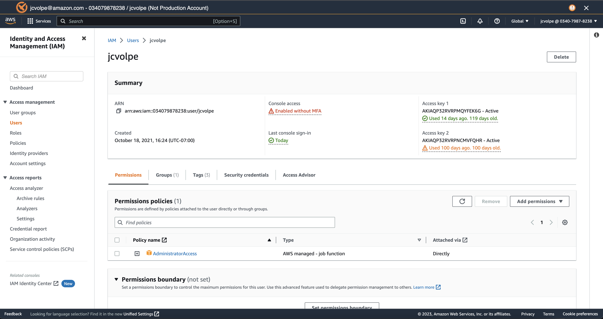

# AWS Projects
An empty repository which exists to provide context around my work at Amazon Web Services on the Identity and Access Management console team. 

## AWS Identity and Access Management Console
### Console Redesign
Utilized AWS's internal UI framework 'Polaris' along with the AWS IAM APIs to implement a UX mock for a new React-based console. This [demo](https://drive.google.com/file/d/1BNKPGXYAASANI5sNNY7UIebjXBa3zVtN/view?usp=share_link) shows off some of the basic features implemented for the 'Users' entity specifically. Created in React using Typescript.

